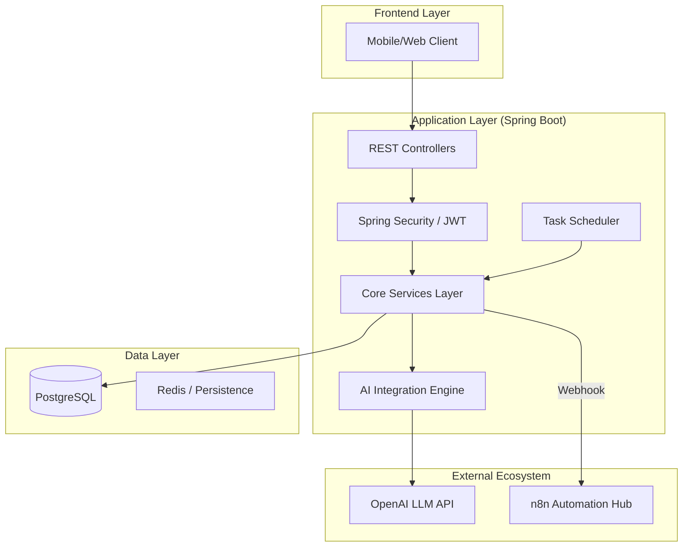
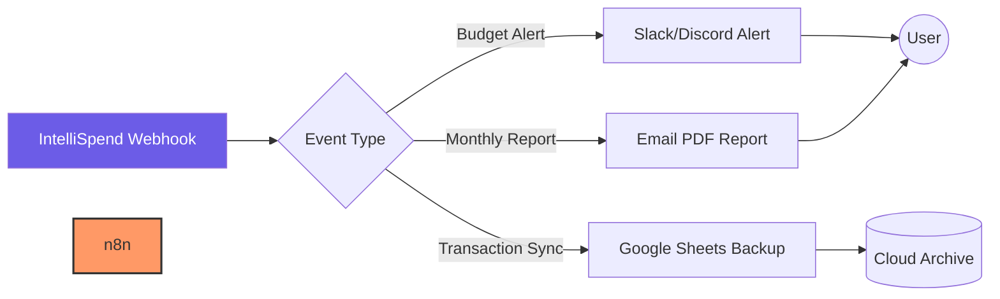

# 💰 IntelliSpend — Next-Gen AI Financial Intelligence

 


IntelliSpend is a high-performance, production-hardened financial tracking ecosystem. It leverages **LLM-powered reasoning** to categorize expenses and provide proactive financial advice, all within a strictly validated, secure Spring Boot environment.

---

## 🏗 System Architecture

IntelliSpend is designed for scalability and resilience. The core Java engine orchestrates data persistence, security, and AI analysis.



---

## 🤖 Advanced Automation with n8n

IntelliSpend features a powerful integration pattern with **n8n**, allowing for real-time notifications and multi-channel report delivery.

### n8n Workflow Visualization


---

## 📂 Project Structure

A deep dive into the IntelliSpend directory architecture:

```text
IntelliSpend/
├── src/main/java/com/intellispend/
│   ├── config/              # Security, JWT, OpenAPI & Web Config
│   ├── controller/          # RESTful Endpoint definitions
│   ├── dto/                 # Data Transfer Objects & API requests/responses
│   ├── entity/              # JPA Domain Models (User, Expense, Budget, Insight)
│   ├── exception/           # Global Exception Handling & Custom Errors
│   ├── repository/          # Spring Data JPA Repositories & Specifications
│   ├── service/             # Business Logic & AI Orchestration
│   └── util/                # JWT Utilities, Constants & Demo Seeders
├── src/main/resources/
│   ├── db/migration/        # Flyway DB Versioning
│   ├── application.yml      # Base Configurations
│   └── application-prod.yml # Production Overrides
├── Dockerfile               # Multi-stage optimized build
├── docker-compose.yml       # Full stack orchestration (App + DB)
└── pom.xml                  # Maven Dependency Management
```

---

## 💎 Premium Features

### 🧠 LLM-Driven Categorization
Uses OpenAI's GPT-3.5 to intelligently classify transactions based on natural language descriptions, fallback to lightning-fast keyword matching when API limits are reached.

### 🛡 Production Hardening
- **Soft Delete**: Data integrity via Hibernate `@SQLDelete` and `@Where`.
- **Global Validation**: Strict JSR-303 constraints on all entry points.
- **Fail-Safe AI**: Implemented `Spring Retry` with exponential backoff for high-availability AI services.

### 📊 Deep Analytics
- **Behavioral Patterns**: Daily and weekly spending trend analysis.
- **Proactive Budgeting**: Real-time threshold monitoring with multi-level alerts (Warning @ 90%, Critical @ 100%+).

---

## 🚀 Deployment Guide

### Rapid Launch (Docker)
```bash
# 1. Provide your OpenAI Key in .env
# 2. Fire up the ecosystem
docker-compose up --build -d
```

### Manual Build
```bash
mvn clean package
java -jar target/intelli-spend-0.0.1-SNAPSHOT.jar
```

---

## 📜 API Documentation
Interactive documentation is available out-of-the-box via Swagger:
🔗 `http://localhost:8080/swagger-ui.html`

---

## 🤝 Project Roadmap
- [x] Phase 1-7: Core Features & Hardening
- [x] Phase 8: Technical Debt & Polish
- [x] Phase 9: n8n Integration & Branding
- [ ] Phase 10: Multi-tenant Support (Upcoming)

---
© 2026 IntelliSpend Engineering. *Built for Financial Clarity. By Tushar*
